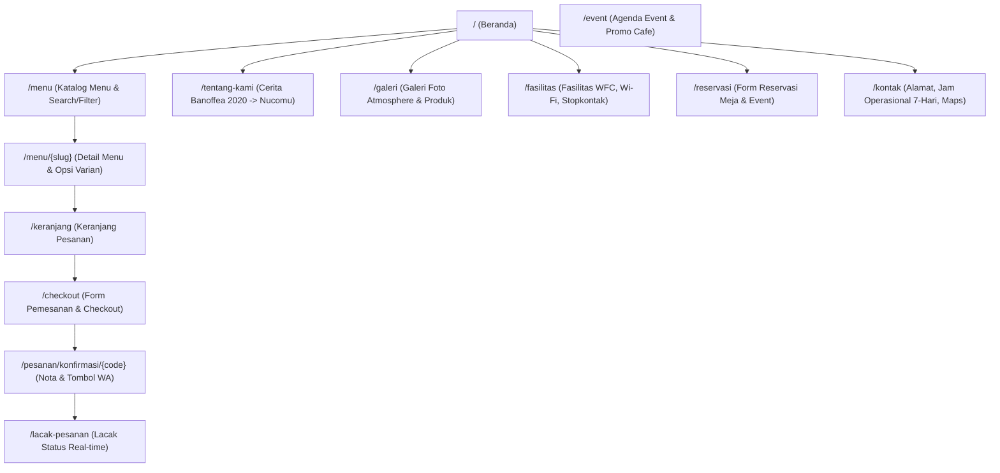
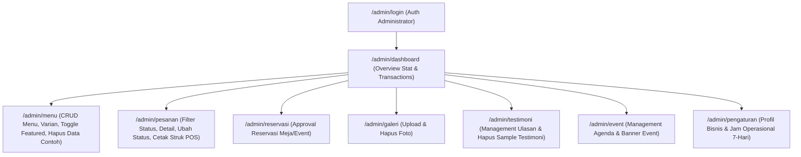

# Sitemap & User Flow Documentation — Nucomu Cafe

Website UMKM Nucomu Cafe Tulungagung ("Coffee & Dessert" — *New, Unforgettable, Comfy, Musings*).

---

## 1. Peta Situs Publik (Public Sitemap)

---

## 2. Peta Situs Admin (Admin Panel Sitemap)

---

## 3. Alur Pengguna (User Flow)

### A. Alur Pemesanan Menu (Ordering Flow)
1. **Pengunjung** membuka halaman `/` (Beranda) atau `/menu` (Katalog Menu).
2. Memilih kategori (Coffee, Non-Coffee, Dessert, Main Course) atau melakukan pencarian keyword.
3. Menekan menu untuk masuk ke `/menu/{slug}`.
4. Memilih opsi varian (contoh: Hot/Iced, Sugar Level, Extra Shot, Topping) dan mengisi catatan khusus.
5. Menekan **"Tambah ke Pesanan"** (tersimpan di Laravel Session Cart).
6. Membuka `/keranjang`, memeriksa ringkasan item & subtotal.
7. Mengisi data pemesan (Nama, No WhatsApp, Tipe Pesanan [Dine-In/Takeaway/Pre-Order], Meja jika Dine-In, dan Metode Pembayaran).
8. Mengirim form checkout. Sistem membuat transaksi di DB dengan status `pending` dan kode unik `NCM-YYYYMMDD-XXX`.
9. Halaman diarahkan ke `/pesanan/konfirmasi/{code}` dengan tombol langsung **"Konfirmasi via WhatsApp"** yang memuat pesan terformat otomatis.
10. Pengunjung dapat mengecek perkembangan status di `/lacak-pesanan?code=NCM-YYYYMMDD-XXX`.

### B. Alur Admin Cafe (Admin Operating Flow)
1. Admin login di `/admin/login` (email: `admin@nucomu.com`, password: `password123`).
2. **Dashboard**: Menampilkan omset hari ini, total transaksi, pesanan pending, dan grafik/tabel pesanan terbaru.
3. **Menu Management**: 
   - Tambah/Edit menu + upload foto + atur varian.
   - 1-Klik **"Hapus Semua Data Contoh"** untuk membersihkan 25+ data menu contoh bawaan seeder saat cafe siap dengan data resmi.
   - Toggle cepat ketersediaan stok & label unggulan.
4. **Order Management**: 
   - Melihat pesanan masuk real-time.
   - Mengubah status (`pending` -> `processing` -> `completed`).
   - Mencetak Struk Nota kasir (Thermal 80mm).
5. **Jam Operasional & Profil**:
   - Mengatur jam buka/tutup dan status libur untuk 7 hari dalam seminggu.

---

## 4. Struktur Database (Schema Overview)

- `categories` (Kategori menu)
- `menus` (Detail menu, price, status, `is_featured`, `is_sample`)
- `menu_options` (Varian / add-on menu)
- `tables` (Daftar meja dine-in)
- `orders` & `order_items` (Transaksi & rincian item)
- `reservations` (Reservasi meja & event)
- `operating_hours` (Jam operasional 7 hari)
- `settings` (Profil cafe)
- `facilities`, `gallery_items`, `testimonials`, `events` (Konten pendukung)
